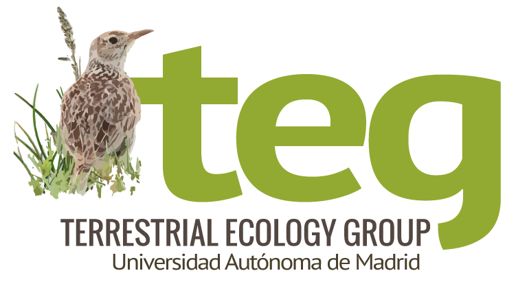
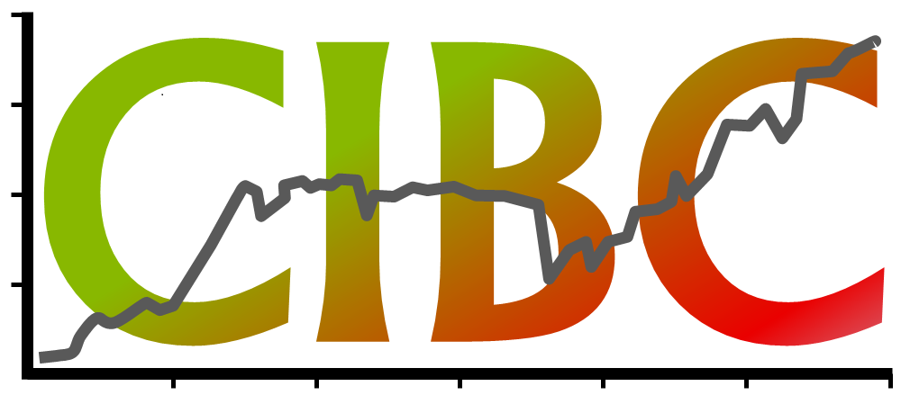

## Equipo

::::::::: columns
::::: column
:::: card-equipo
::: {style="display: flex; justify-content: left; align-items: left; padding-top: 10px;"}

:::

#### Equipo de trabajo en la <a href="https://www.uam.es/" target="_blank">UAM</a>:

-   Javier Seoane ([javier.seoane\@uam.es](mailto:javier.seoane@uam.es))

-   Diego Llusia ([diego.llusia\@uam.es](mailto:diego.llusia@uam.es))

-   Guzmán Verde ([guzman.verde\@uam.es](mailto:guzman.verde@uam.es))

-   Inés Díaz ([ines.diaz\@uam.es](mailto:ines.diaz@uam.es))
::::
:::::

::::: column
:::: card-equipo
::: {style="display: flex; justify-content: left; align-items: left; padding-top: 10px;"}

:::

#### Equipo de trabajo en <a href="https://seo.org/" target="_blank">SEO/BirdLife</a>:

-   Virginia Escandell ([vescandell\@seo.org](mailto:vescandell@seo.org) )

-   Juan Carlos del Moral ([jcdelmoral\@seo.org](mailto:jcdelmoral@seo.org) )

-   Emilio Escudero ([eescudero\@seo.org](mailto:eescudero@seo.org) )
::::
:::::
:::::::::

 <a href="https://www.teguam.es/" target="_blank"> Grupo de Investigación de Ecología y Conservación de Ecosistemas Terrestres de la UAM</a>  <a href="https://www.uam.es/uam/cibc" target="_blank"> Centro de Investigación en Biodiversidad y Cambio Global de la UAM</a>
