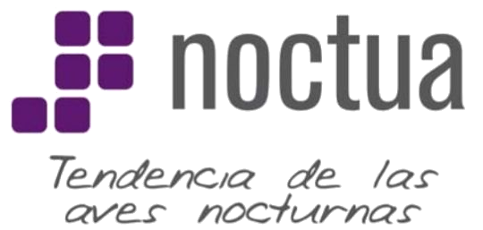
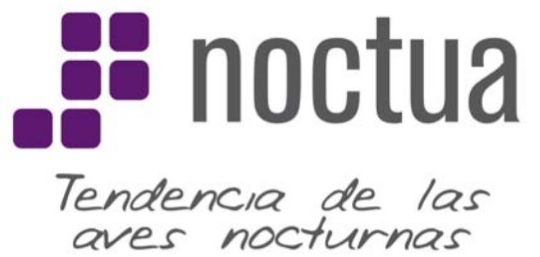
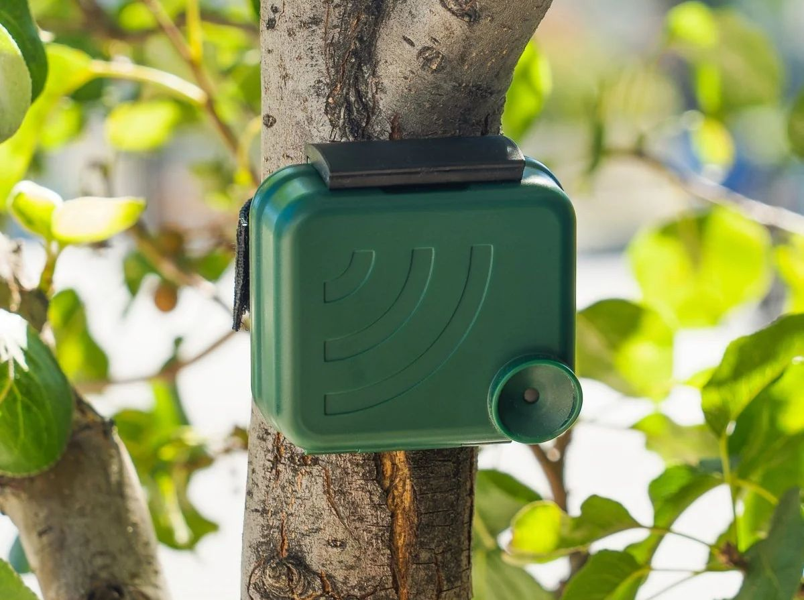

Ampliación del programa de seguimiento de aves nocturnas NOCTUA de SEO/BirdLife usando **monitoreo acústico pasivo** (MAP).

::::::: contenedor-botones-inicio
::: {.card-inicio onclick="location.href='proyecto.html'"}
¿En qué consiste el proyecto?
:::

::: {.card-inicio onclick="location.href='equipo.html'"}
¿Quiénes somos?
:::

::: {.card-inicio onclick="location.href='resultados.html'"}
¿Cuántos puntos de muestreo hay y dónde se ubican? ¿Cuántas personas participan?
:::

::: {.card-inicio onclick="location.href='participar.html'"}
¿Cómo puedes participar?
:::
:::::::

## Más información sobre...

::::::::: contenedor-info-inicio
:::: {.card-info-inicio onclick="window.open('https://seo.org/noctua-4/', '_blank')"}
::: card-contenido-info-inicio

Programa NOCTUA

:::
::::

:::: {.card-info-inicio onclick="window.open('https://seo.org/ciencia-ciudadana/', '_blank')"}
::: card-contenido-info-inicio

Programas de ciencia ciudadana de SEO

:::
::::

:::: {.card-info-inicio onclick="window.open('https://seo.org/seguimiento-de-avifauna-resultados/', '_href')"}
::: card-contenido-info-inicio

Resultados de los programas de seguimiento

:::
::::
:::::::::

## ¿Qué es el monitoreo acústico pasivo?

::: contenedor-map

Se trata de una **metodología de seguimiento** de vida silvestre **no invasiva**, que permite documentar la presencia y comportamiento de especies que emiten vocalizaciones de forma **automatizada**. Es **complementaria** a los métodos tradicionales de muestreo y consiste en el uso de las llamadas **unidades de grabación autónomas**.

:::

En el caso del proyecto NOCTUA+, se utilizan grabadoras de la marca Audiomoth, que se programan para grabar en un determinado periodo y con una determinada frecuencia, se colocan en el campo y una vez finalizado el periodo de muestreo se recogen para el análisis de los audios.

## Contacto

{style="vertical-align: text-top; margin-right: 7px;" width="25"} [noctua\@seo.org](mailto:noctua@seo.org){.email}

{style="vertical-align: text-top; margin-right: 7px;" width="25"}91 434 09 10
