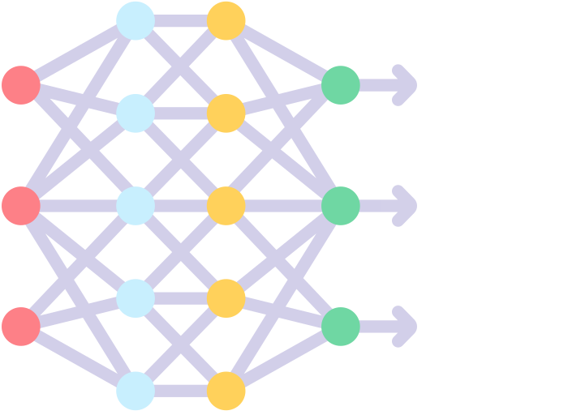

## Historia

::: justificado
SEO/BirdLife desarrolla desde hace años el **programa de seguimiento de aves nocturnas “NOCTUA”** dentro de sus distintas actividades de monitorización de la biodiversidad a través de la ciencia ciudadana. Este programa tiene como objetivo describir las tendencias poblacionales de las aves nocturnas y se basa en las escuchas activas que desarrollan **voluntarios y voluntarias** de acuerdo con un protocolo estandarizado. Desde 2024, Diego Llusia y Javier Seoane, del Departamento de Ecología de la Universidad Autónoma de Madrid y adscritos al Centro de Investigación en Biodiversidad y Cambio Global, y sus estudiantes tutelados han colaborado informalmente con ese programa para fortalecerlo con herramientas basadas en **seguimiento acústico pasivo**.

En el marco de esta colaboración, el equipo de trabajo durante el primer trimestre de 2025 diseñó un protocolo de grabación mediante grabadoras automáticas, configuró los equipos a enviar a los voluntarios y desarrolló actividades de capacitación (documentación de apoyo y reunión con los voluntarios). SEO/BirdLife proporcionó las grabadoras automáticas a los voluntarios del programa.
:::

## Objetivos

::: justificado
El objetivo último del proyecto es diseñar una propuesta de **seguimiento de especies de aves diana mediante grabadores automáticos como apoyo al programa NOCTUA**. Para ello se requiere:
:::

::::::::::: contenedor-objetivos-proyecto
:::: card-objetivos
::: contenido-card

Capacitar a los voluntarios para desplegar y manejar las grabadoras

:::
::::

:::: card-objetivos
::: contenido-card

Elaborar un sistema de almacenamiento y gestión de la información

:::
::::

:::: card-objetivos
::: contenido-card

Desarrollar modelos de reconocimiento de sonido y determinar su desempeño

:::
::::

:::: card-objetivos
::: contenido-card

Elaborar índices que informen sobre las tendencias temporales de las especies

:::
::::
:::::::::::